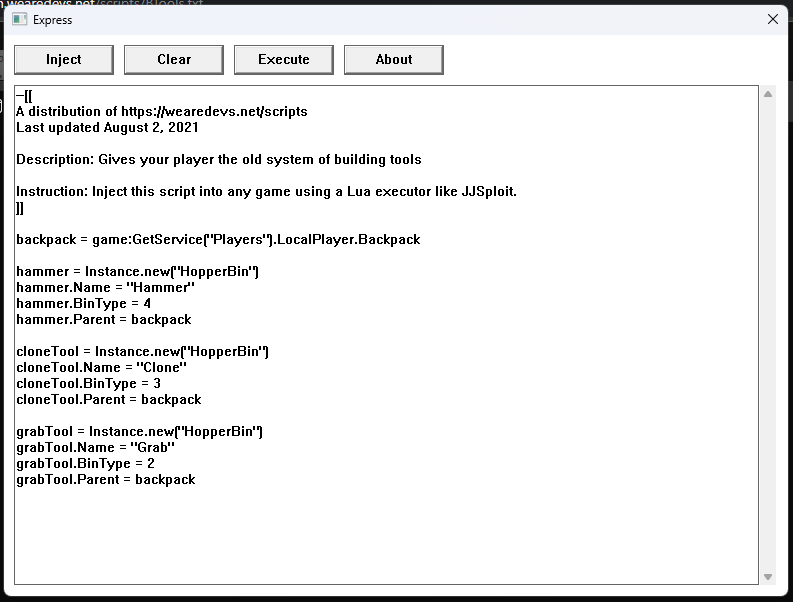

# Express
## Image

## About
Express is an attempt to create a fully open source ROBLOX exploit while having functionality (see `Contributing` below). **Please note that Express's actual ability to execute scripts isn't working yet**. We rely heavily on our own time and contributors to be able to have Express functional.
## Building & running
To build and/or run Express, you'll need Visual Studio installed. Clone the git repository, and then press `Ctrl` + `Shift` + `B`.
To run Express, simply press `Ctrl` + `F5`.
## License
Express is licensed under `GNU General Public License 3.0`. I (the creator) chose this license, because this will prevent skids from legally copying off of Express for their own gain.
## Contributing
All contributions are welcomed and encouraged. What we currently **really need** now, is help with reverse engineering ROBLOX in order to find a bypass for Hyperion (Byfron's ROBLOX anticheat).
